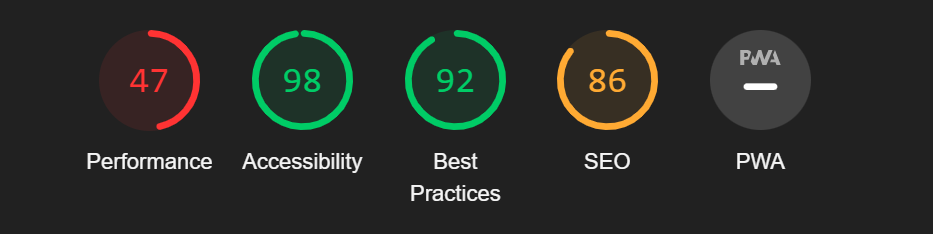
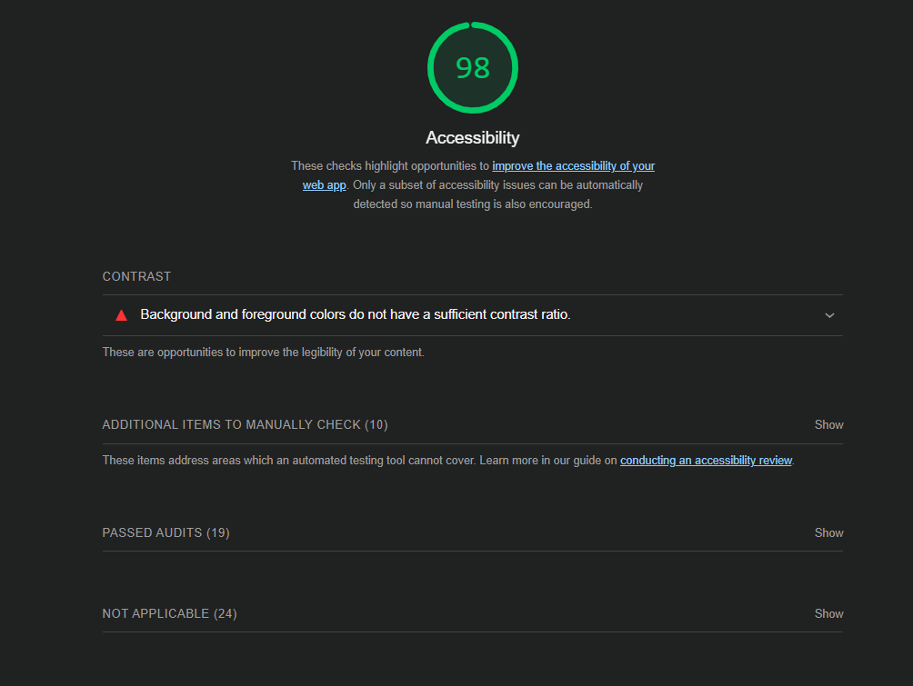
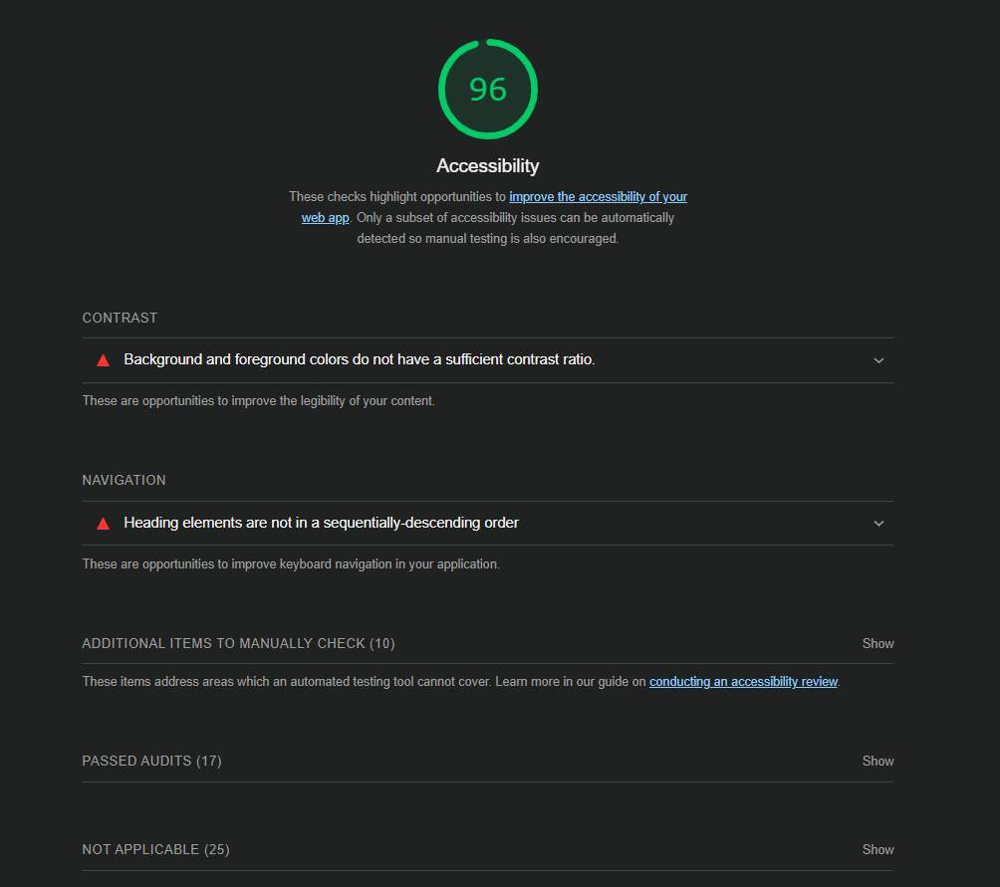
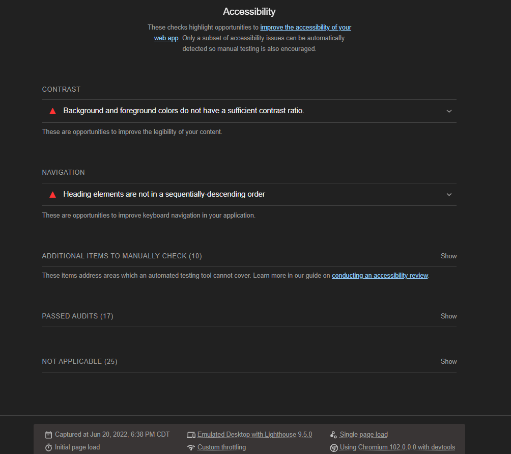
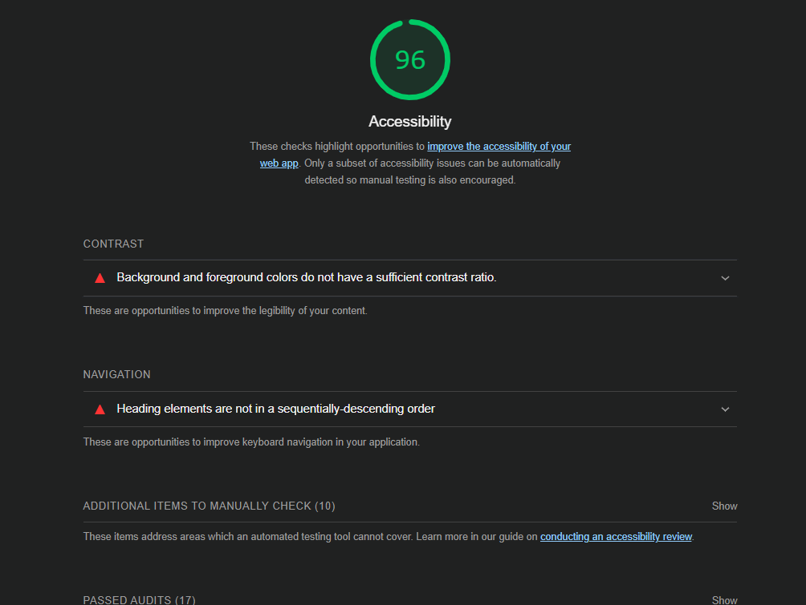
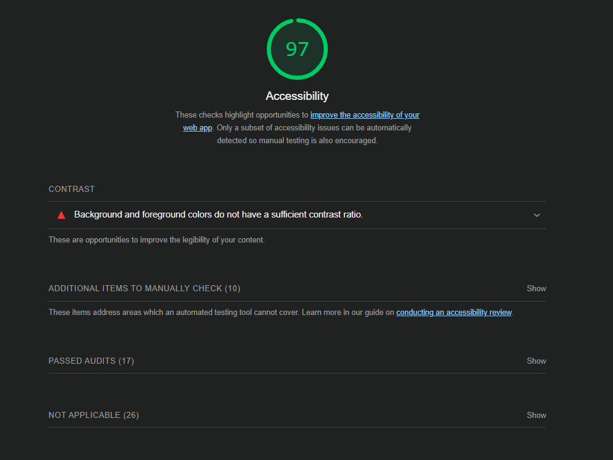
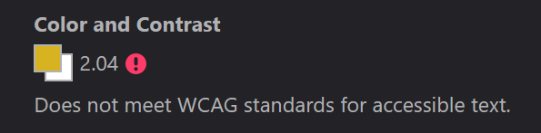
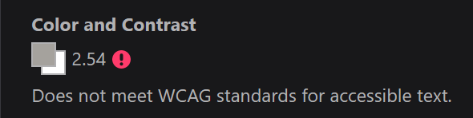

----

## Introduction
Leading production of your site with an accessibility first mindset creates a more richly and empathically functional end user experience overall. Continuously working to improve web accessibility is ultimately a way to ensure that as many people as possible are able to visit your site, no matter the physical or cognitive hurdle they may be experiencing.

The idea that the overall accessibility of a website is the responsibility of the developer creating the website was something that hadn't initially occurred to me when first learning to code them. I was unaware that the needs of many users are often overlooked, and that this is an ongoing issue in web development. This drove a curiosity in me to learn more. After I started considering more and more about accessibility in my projects, planning projects with accessibility at the forefront has become easier and easier, and also rewarding. With ever increasing accessibility, comes richer functionality and smoother experience in the website. Also knowing that fewer roadblocks are left in place with each new accessibility minded endeavor and each new skill learned, leaves a more satisfying and complete feeling to the process of creating these digital spaces.

My aim with this document is to help shed some light on how to approach a project with an accessibility first mindset. And, at the very least, equip the reader with the tools to be able to approach any webpage, in particular the SciComm Identities Project (SCIP) website, and be able to evaluate it efficiently and effectively. I understand that the reader is most likely not going to be a programmer or professional web developer, but it is my hope that they are able to be effective at creating considerate and inclusive websites, nonetheless, with the help of this guide. And if it fuels curiosity for further learning, that's awesome!

To begin, a list is presented to outline general steps that can be taken to consider the accessibility of a webpage. They don't necessarily need to be in this order, this is just one approach.

Next, these steps are applied to evaluate the SCIP webpages that were present at the start of this project. Any accessibility opportunities that were found are listed and explanations are provided. Most of the time with some form of visual aid, sometimes video.

To wrap things up, the "Steps to Take in Future" walks through how to access the tools that were used along with examples of their use. This is meant to provide further blueprint for continued evaluation. Ensuring your site remains accessible as it grows, or standards change, is a continuous process.

Some extra links with additional information to help expand the reader's knowledge, and offer some additional assistance where relevant, are also provided at the end.

It also bears mentioning that this guide is intended solely for the use of the SciComm Identities Project team of the MetCalf Institute to help them bolster the overall accessibility of their website. It also provides some tools that I have found to be useful in continuing to develop an accessibility at the forefront mindset. This document, the commentary, the recommendations and their corresponding arrangement within this document are the sole product of wardOfCode, Christopher Ward, unless clearly referencing material from various tools and the various links provided. This following work is solely my own and has not been copied from, or collaborated with, other works or entities.

Thank you for your patience and confidence.

## Steps Taken
To evaluate how accessibile a website is, there are a few methods I can utilize.
1. The first set of tools I go to are the Developer Tools, available in every major desktop/laptop browser.
    1. I can use these tools to get a clearer picture of how a browser is showing my site by seeing the overall structure of the site, any styling that is being applied, and any programming associated with the site.
    2. I can also see any accessibility opportunities that the browser may have noticed.
    3. Descriptions on how to find these tools and how to use them are provided in "Steps to Take in Future" section of this document.
2. Next I will go to the Lighthouse feature in the Chrome DevTools to check the browsers accessibility assessment of the page. I will do this for each page, in Desktop and Mobile simulated views.

3. I usually start in Chrome and then go to Firefox to utilize the Firefox Inspector's Accessibility checker to get another view from a different browser. The interface for the accessibility checker is also very helpful in Firefox. The Accessibility Properties of the Firefox Inspector tool shows the structure of the webpage through its semantic roles and how they relate. It also can check the font contrasts, keyboard navigability, and text label clarity of a webpage. It also can simulate various forms of color blindness and how users with those types of vision may see the content of the page. There are multiple built in tools in the browser to get an initial understanding of how accessible your pages are to other users.

4. I will also use the [WebAIM Color Contrast Checker](https://webaim.org/resources/contrastchecker/){:target="_blank" rel="noopener"} to help find more accessible matches for background and foreground when the need arises. However, on the fly, the browser devtools color picker tool will usually provide a helpful [Web Content Accessibility Guidelines (WCAG)](https://www.w3.org/WAI/standards-guidelines/wcag/){:target="_blank" rel="noopener"} score for the background / foreground color combination. As I describe later, this tool is also integrated into the WAVE Web Accessibility Evaluation Tool suite.

5. The [WAVE WebAIM Accessibility Evaluation Tool](https://wave.webaim.org/){:target="_blank" rel="noopener"} provides a further detailed picture of your page's underlying structure and the impacts on accessibility. WAVE provides increased clarity to each of the highlighted potential points of improvement to the webpage it is analyzing. It is great for seeing all of the accessibility opportunities visually represented on the webpage with some steps on how to incorporate the suggestions. Additional details over this and other tools' features, as well as how to use them, are also available in the "Steps to Take in Future" section of this document.

7. Now that the general accessibility of the page is determined from manual and automatic testing, and visual analysis of the page, it is time to see how many of these features all come together to impact the "sound" of a webpage. The screen reader used by a visually impaired user, and how it reads the site, will completely determine their overall experience of the page. There are many different screen readers, including Job Access With Speech (JAWS) and [Non Visual Desktop Access (NVDA)](https://www.nvaccess.org/download/){:target="_blank" rel="noopener"} for Windows, the built-in VoiceOver for Apple and iOS, ChromeVox on Chromebooks and TalkBack for Android devices. They all accomplish the same basic functions and will interpret the structure of your webpage in similar ways. The most popular Windows screen reader is JAWS, but perhaps the most accessible (and free) screen reader for Windows is NVDA. NVDA is the screen reader I used for the Screen Reader portion of this assessment.

- There are many ways to assess a user's experience and these tools are just another way to improve the overall function and utility of a webpage. When it is found that there may be things that are hindering or lessening a user's experience, these acquired data are opportunities to build a more complete and inclusive digital space.

## Opportunities Discovered and Overview
- This section covers specific opportunities to improve the accessibility of the SCIP website. It is broken up into various subsections containing information and discussion pertaining to those opportunities within the SCIP website.
  - This includes Chrome and Firefox browsers' built-in accessibility assessments
    - Much of the changes suggested relate to some of the background and foreground color contrasts falling below standards and may cause visual issues for some users.
    - Some heading level issues are also highlighted.
  -  Additionally there are some other noted observations, as well as interpreted screen reader results.


### Found in Google Chrome Lighthouse
- Google Chrome Lighthouse is usually my first glance to quickly get a sense of what's going on in my webpage because I don't have to go to another site, let alone another browser, since I'm viewing my webpages on google chrome. It can test for many different aspects of how a website was put together and its presentation to the user. It shares some parallels with other browsers' internal testing features.
  - Presented below are all the scores, not just Accessibility, from the Lighthouse scan of the SCIP "Home" page.
  - 
  - [View image of SCIP Lighthouse scores in separate tab](https://christopher-ward.github.io/SCIP-Accessibility/media/Tll3lEE24-clipboard.png){:target="_blank" rel="noopener"}
  - We will just be focusing on the Accessibility portion, but the other information is interesting to learn about and may be worth a look, however it is easy to get lost down a rabbit hole with much of the information.
  - The accessibility score was 98.
    - Overall, really good.
    - But those last two points could really make a difference to someone.
    - Also, this is an automatic scan and may not catch everything.
    - We will investigate further
    - Link on Lighthouse and Scoring available in "Additional Links" section
  - The performance score is most likely due to the internal functions and practices of WordPress and mostly out of your control, however making sure that the mobile versions of your pages have images that are reduced in size accordingly will also increase the performance on mobile.

#### Home Page Color Contrast
- One of the things highlighted in the scan of the home page is the color contrast between the text color and the background color of the anchor, or link, elements
  - The color contrast ratios of the links are too low.
- The following is a gif that shows the color contrast issues for the link text found in Chrome Lighthouse.
  - This specific page is the home page, but the light yellow text with white background links, and sometimes the inverse, are on every page.
  - [View gif of Home page scan in separate tab](https://christopher-ward.github.io/SCIP-Accessibility/media/ECjDiXD03-Home_Accessibility_Color_Contrast.gif){:target="_blank" rel="noopener"}


- Below is a gif of the Lighthouse result for the mobile version of the Home page with similar notes on link color contrast.
  - The following gif shows the same color contrasts noted in the previous scan, just in the mobile version this time
  - [View gif of Mobile Home page scan in separate tab](https://christopher-ward.github.io/SCIP-Accessibility/media/hgbGShFAK-Home_Accessibility_Color_Contrast_Mobile.gif){:target="_blank" rel="noopener"}




#### About Page Color Contrast and Heading Elements
- On the About Page, the Color Contrast is also highlighted by the Lighthouse scan.
  - [View gif of About page scan in separate tab](https://christopher-ward.github.io/SCIP-Accessibility/media/GVfHXo_sh-About_Accessibility_Chrome.gif){:target="_blank" rel="noopener"}


- The sequence of headings on the page is noted at the end of the above gif.
  - The second gif, found below, shows the information in the dropdown.
  - The about page jumps from h3 to h6 level headings and is out of sequence, as shown in the gif below. Using headings in relevant sequential order improves the clarity of the page structure, especially when using screen readers.
  - I also discuss the headings in further detail later in the screen reader subsection.
    - [View second gif of About page scan, relating to headings, in separate tab](https://christopher-ward.github.io/SCIP-Accessibility/media/B0MQfzz5I-About_Accessibility_Header_Order_Desktop_Chrome.gif){:target="_blank" rel="noopener"}



#### Research Page
- The Research Page in Mobile view has results similar to the desktop view, so I am only showing the mobile version results for sake of brevity.
- The color contrast is only mentioned for the menu button because it is hiding the other nav links that are shown when the button is touched
  - The below gif shows just the contrast mentioned
  - A Navigation comment from Chrome, seen in this first gif, is expanded on in the second gif
- [View gif of Research page scan in separate tab](https://christopher-ward.github.io/SCIP-Accessibility/media/4fsRExnA8-Research_Access_Contrast_Chrome_Mobile.gif){:target="_blank" rel="noopener"}


- [View second gif of mobile Research page scan in separate tab](https://christopher-ward.github.io/SCIP-Accessibility/media/uhBupEq5k-Research_Access_Navigation_Chrome_Mobile.gif){:target="_blank" rel="noopener"}


  - Headings jump to h4 element from h1 element "Research"
    - headings should be sequential and define the relative structure of the information of the page
    - You can always just change the font size of the relevant heading element to match the desired font size
  - There is also the matter of whether this should even be a heading
  - I talk about this specific situation in the screen reader section as part of the research page discussion

#### Fellowship Page
  - The Fellowship page generally had the same highlights in regards to the links' color contrasts as previously noted from scans of previous pages.
    - The below gif shows the nav bar and 'apply now' button contrast warnings
    - [View gif of Fellowship page scan in separate tab](https://christopher-ward.github.io/SCIP-Accessibility/media/seL9iyas4-Fellowship_Access_Contrast_Chrome_Desktop.gif){:target="_blank" rel="noopener"}



### Found in Firefox Inspector
- Firefox Inspector Accessibility Properties accomplishes many of the same functions as Chrome's built-in tester, just presenting them in a different way and with some different insight. The two can complement each other well. In the scans, the tester brought attention to many of the same things as Chrome. For this reason I only list a few with some clarified details.

#### Link Text Color
- The colors of the texts associated with links, or anchors, have the ratio score of 2.04.
  - This score falls below [WCAG standards](https://webaim.org/articles/contrast/){:target="_blank" rel="noopener"}
  - The score can be improved by adjusting the colors to have a stronger contrast
    - The colors can be found in the WordPress editor as well as the DevTools
    - Hints on how to improve the score are also mentioned in the "Steps Taken" section, as well as the "Steps to Take in Future" section, using some of the tools discussed.

- 
- [View link contrast ratio image in separate tab](https://christopher-ward.github.io/SCIP-Accessibility/media/5aMSHvSPi-Link_Text_Color_Contrast.PNG){:target="_blank" rel="noopener"}
- The few links with the inverse of these foreground and background colors, for example the "Apply Now..." link at the top of the Fellowship page, also have an identical ratio of 2.04 but is not shown here.
- These links may be hard for some users to see clearly.

#### Search Bar Color Contrast
- The following screenshot is from the score given for the color contrast ratio of the search bar at the top right of each page. As with the above link text color, this low score of 2.54 also indicates the content may be hard to see for some users.

- 
- [View search bar contrast ratio image in separate tab](https://christopher-ward.github.io/SCIP-Accessibility/media/c9UN6DAsu-clipboard.png){:target="_blank" rel="noopener"}

#### More From Firefox Inspector
- As mentioned earlier, the inspector will show the semantic structure of the webpage. More on semantic structuring is mentioned in the Screen Readers subsection.
  - A gif of how to access this feature is shown in the "Steps to Take in Future" section.
- Text labels, or alt text, for programmatic functions, figures or images are necessary for visually impaired individuals.
  - Except for situations where the image does not provide important context for the information being presented, such as an image of an individual in a Bio; or if a thorough description of the image/gif/graphic is provided immediately before or after the image.
  - When an image contains key information for the viewer, determine if concise alt text should be applied to the image properties for screen readers to relay important information to the user
    - Note that this text will also be displayed if the image fails to load for some reason

### Navigation
  - Addition of Footer navigation will greatly increase ease of site navigation
  - Addition of "Home" link in Menu / Navigation will also improve ease of traversal (I noticed the addition of a "Home" link after writing these points, but left for emphasis)
    - Not obvious that the header at the top is a link back to the home page
      - Could confuse some users
      - Best to have a "Home" link as well
        - Even if the "Home" page is meant as a landing page and may have information that repeats, it still may be helpful to have a "Home" just for clarity's sake

#### Keyboard Traversal
  - When moving through the site by keyboard, all the clickable elements that are interacted with by mouse, should also be navigable by keyboard. Using the tab key will progress you through the clickable elements. It is important to have an easily visible visual aid, or box, to tell where the current "focus" is on the page. Many links on the site have very subtle focus or none at all
    - Most of the links have a focus box but is quite small
      - Also affected by low contrast but could improve with contrast issue fix
      - Could also help to slightly increase size
    - The rounded links only have some focus
    - The dark square links on the Fellowship page have no focus at all
      - Submit Application
      - Contact Us
    - Below is a gif displaying the elements described above with the current focus
    - [View gif of interactive element focus tool in separate tab](https://christopher-ward.github.io/SCIP-Accessibility/media/0KmHj5n2H-Elements_Focus_Visual_Aid.gif){:target="_blank" rel="noopener"}


   - In the above gif the three focus situations described previously are shown
     - Not shown are the yellow text links that are not in the dark background box and are even harder to distinguish the focus
     - There is also a brief display of how to force an element's "focus" in the DevTools by clicking :hov and selecting :focus
       - Note that the code changed in DevTools is not saved and changes must be applied directly to your own code
         - Coming from experience it's not very fun when the changes you spent the past 30 minutes working on have suddenly disappeared when refreshing the page and you forgot to transfer your new color/styles/sizes
     - Tabbing through using the keyboard will display the focus box as well
       - Also note that this is separate from the boxes displayed using the "Show Tabbing Order" feature
   - Improving these elements focus styles will improve the experience of sighted users with some form of visual impairment
     - This will also help all users keep track of where they are in the page when using a keyboard

### "Home" or "Landing Page"
  - Missing a First Level Heading "H1"
    - It is important to have a first level heading, h1, on every page and especially before progressing to h2.
      - Could be the name of the website on the home page
      - Could also be the "Embracing science communicators'..." banner line
      - Whatever feels relevant as the Title/Theme/Purpose of the home page
    - Here is [W3C's explanation of headings](https://www.w3.org/WAI/tutorials/page-structure/headings/){:target="_blank" rel="noopener"}
    - Here is [the MDN web docs information on headings and accessibility related to their ordering](https://developer.mozilla.org/en-US/docs/Web/HTML/Element/Heading_Elements#accessibility_concerns){:target="_blank" rel="noopener"}
    - I discuss headings in the screen reader videos in the next section as well, but hopefully the above links can also be helpful and serve as another reference to help navigate heading use

### Screen Readers
   - There are a few different screen readers out there that can help users navigate sites by having the content read aloud to them, as well as providing useful keyboard shortcuts, navigation tools, mouse interaction, and also braille feedback for braille devices.
   - The screen reader used for this project is [NVDA](https://www.nvaccess.org/download/){:target="_blank" rel="noopener"}
     - Free Open Source Screen Reader on Windows
       - A great way to understand how screen readers will interact with the site
     - More info on this screen reader and others in general will be provided in the following subsections, as well as in the previous "Steps Taken" section, the upcoming "Steps to Take in Future" section, and the "Some Additional Links" section
   - The following subsections include videos of the screen reader being used to hear how the SCIP website sounds
     - The first video is an introduction to the screen reader and what to expect in the videos
     - The second video is a full reading of the Home page
     - The subsequent videos will focus on individual opportunities highlighted by the screen reader
       - The videos also include some recommendations to help improve the user experience

#### Screen Reader Introduction Video
- I created a quick intro video to describe how the screen reader is used and what to look for and consider.
  - This video can be found below
  - [SCIP - Screen Reader Intro](https://www.loom.com/share/e25e779e70c64b86a4472d432595e615){:target="_blank" rel="noopener"}

<div style="position: relative; padding-bottom: 72.12885154061624%; height: 0;"><iframe src="https://www.loom.com/embed/e25e779e70c64b86a4472d432595e615" frameborder="0" webkitallowfullscreen mozallowfullscreen allowfullscreen style="position: absolute; top: 0; left: 0; width: 100%; height: 100%;"></iframe></div>
- The first video below is a full reading of the Home page
- Subsequent videos will stop the screen reader routinely and not read the whole page

#### Home / Landing Page
- The video below provides a Full Read of the Home Page as described in the intro video. **Caution**, the Screen Reader starts at **0:13** and will be **much louder** than my voice at the beginning.
  - [Home Page Full Screen Reading (NVDA) [**LOUD after 0:13**]](https://www.loom.com/share/0f793793c6f74cb496855693a1aeaf17){:target="_blank" rel="noopener"}

<div style="position: relative; padding-bottom: 64.6888567293777%; height: 0;"><iframe src="https://www.loom.com/embed/0f793793c6f74cb496855693a1aeaf17" frameborder="0" webkitallowfullscreen mozallowfullscreen allowfullscreen style="position: absolute; top: 0; left: 0; width: 100%; height: 100%;"></iframe></div>

- The video shows the Screen Reader reading through the Home Page to give an idea of how a screen reader will walk through a page and how it describes the elements. A user may also skip around the page using hotkeys specific to the screen reader but this first video is meant to paint the full picture of the page.
- I had previously made a video talking about the benefits of adding a “Home” button to the navigation bar, but noticed that it has already been added since I started.
    - Adding a "Home" link in the navigation bar was definitely a good choice to benefit all users

#### About Page
- The video below will include discussion of headings on the About page and the screen reader’s interaction with them.
  - [SCIP – About Page - Headings Discussion [**LOUD after 0:07**]](https://www.loom.com/share/e6c7574c900f4c69940a26912b7f655a){:target="_blank" rel="noopener"}

<div style="position: relative; padding-bottom: 63.817663817663814%; height: 0;"><iframe src="https://www.loom.com/embed/e6c7574c900f4c69940a26912b7f655a" frameborder="0" webkitallowfullscreen mozallowfullscreen allowfullscreen style="position: absolute; top: 0; left: 0; width: 100%; height: 100%;"></iframe></div>

- In the video, the "Team" section is highlighted
  - I suggest that a new heading level under team member names is unnecessary
    - If keeping additional heading level, it should change to h4, instead of keeping as h6, and modify the font size to get the desired h6 font size
      - The heading level jumps from h3 to h6 and may be confusing to screen reader users.
        - Screen readers read aloud the type of element and this reads as "h3 [name of team member]" and then "h6 [title of team member]". This may be confusing

#### Research Page
- The discussion about the Screen Readers interpretation of the Research Page and some potential enhancements can be found in the following video
  - [SCIP - Research Page - Headings and Information Sectioning](https://www.loom.com/share/cdaebdc934e5449dbff6b4288580566a){:target="_blank" rel="noopener"}

<div style="position: relative; padding-bottom: 61.016949152542374%; height: 0;"><iframe src="https://www.loom.com/embed/cdaebdc934e5449dbff6b4288580566a" frameborder="0" webkitallowfullscreen mozallowfullscreen allowfullscreen style="position: absolute; top: 0; left: 0; width: 100%; height: 100%;"></iframe></div>

- The video highlights:
  - Recommendation of additional headings that could help improve the overall flow and navigability of the Research webpage
  - Changing the h4 blocks at the end of the page to different element types
    - The block information shouldn't be a heading element
    - Recommend a short heading to describe the information instead
    - Recommend change the h4 blocks to paragraph elements
      - Can keep the size and colors if desired but shouldn't be headings
        - Headings should be concise and signal related information to follow
          - It helps screen reader users
            - Also improves flow of webpage

#### Fellowship Page
- The video below contains discussion about the Fellowship Page screen reading experience and potential opportunities for enhancement
  - [SCIP - Fellowship Page - Heading Structure](https://www.loom.com/share/dc002c9fdd9f4982b798796534d4fb69){:target="_blank" rel="noopener"}

<div style="position: relative; padding-bottom: 68.06136680613668%; height: 0;"><iframe src="https://www.loom.com/embed/dc002c9fdd9f4982b798796534d4fb69" frameborder="0" webkitallowfullscreen mozallowfullscreen allowfullscreen style="position: absolute; top: 0; left: 0; width: 100%; height: 100%;"></iframe></div>

- The video highlights:
  - Opportunity for h3 subheadings on the Fellowship page
    - Clarification of subsections of information within the "Fellowship Goals & Commitments" section of the Fellowship Page
      - Specifically, making the one word bolded titles, i.e. "Training", "Evaluation", and "Podcasts" into h3 headings
        - This can improve the experience of screen reader users
        - Can keep bolded and slightly increase size
          - Will help group the information better and improve page flow for all users

#### Footer Navigation
- The video below features a discussion about the potential benefits of adding a Footer Navigation
  - [SCIP - Footer Discussion](https://www.loom.com/share/68ea61809a1345738bc987f0ee1d7595){:target="_blank" rel="noopener"}

<div style="position: relative; padding-bottom: 69.90291262135922%; height: 0;"><iframe src="https://www.loom.com/embed/68ea61809a1345738bc987f0ee1d7595" frameborder="0" webkitallowfullscreen mozallowfullscreen allowfullscreen style="position: absolute; top: 0; left: 0; width: 100%; height: 100%;"></iframe></div>

- In the above video, I suggest the opportunity for a footer navigation
  - The case is made for the addition of internal links within the footer at the bottom of each page
    - These internal links would act the same as the links in the header navigation at the top of each page
      - Reader would be able to easily move to anywhere else in the site at the end of each page.
        - Helpful for users that use a Screen Reader, and also users that are not
        - Would keep the reader engaged and reminded of the structure of the site
  - Additional external links could also be added
    - Some examples:
      - Ways for readers to reach out or help
      - Fellowship Application Link
        - In case the user decides to apply when not on the fellowship page
      - Social Media if relevant
      - Podcast Link when available
      - Other related projects
      - Other URI links if desired
      - Additional Relevant Information
      - Accessibility Statement or link to an Accessibility Statement
  - The addition of some form of site navigation in the footer of each page would greatly increase ease of use of the site
    - Users of all types, including screen reader users would benefit


### Accessibility Statement
  - Accessibility Statements are something that is becoming more common in sites with high user traffic and interaction.
  - These statements put forth as a recognition and consideration of the diverse needs of users
    - Accessibility statements act as a sort of pledge to build and maintain sites that are sensitive to the needs of their users
      - There is usually a way for the user to get in touch with the website's managers to inform them of any issues that they may notice or any information they are struggling to access due to some form of accessibility roadblock
    - They can also sometimes acknowledge areas in a site that need improvement and are currently being worked on
  - An accessibility statement could be added at the bottom of the page in the footer, or in a link to another page, at the bottom of each page with contact information to get in contact if there are any issues or features missing that are impacting the access of users.
    - Something like: "We strive to make our website as accessible as possible to as many users as possible. If you are having any issues accessing our site or notice opportunities to make our site more accessible, in accordance with [WCAG standards](https://www.w3.org/WAI/standards-guidelines/wcag/){:target="_blank" rel="noopener"}, please reach out at 'help@oursitedomain'."
    - There are many resources available online to give you a good idea as to how best structure your own Accessibility Statement
      - A good place to start is [W3C Web Accessibility Initiative's "Developing an Accessibility Statement"](https://www.w3.org/WAI/planning/statements/){:target="_blank" rel="noopener"}

### Opportunities Discovered Conclusion
 - What we saw:
   - Results from the Chrome Lighthouse tool
     - Color Contrast for links should be addressed
     - Heading inconsistencies should be addressed
   - Firefox Accessibility Properties Inspector
     - Same recommendations as Chrome Lighthouse scanner
     - It also didn't like the color contrast of the search bar above the navigation
     - We also covered the concept of Text labels for visual content when needed to convey important context
   - NVDA Screen Reader illuminated how the site would be heard
     - Some headings opportunities
       - Some headings need to be changed
       - Some should be changed to different elements altogether
       - Some headings should be added
     - Addition of navigation for the site's pages, and any relevant external sites desired, in the footer element at the end of each page
       - Would maintain clarity of website structure effectively
       - Would offer easier navigation through the site
       - Helps screen reader users more efficiently travel between pages of the site
     - Staying aware of how a screen reader interacts with a webpage is an important and ongoing process as a webpage develops and changes. Information and links are provided in the "Steps to Take in Future" section under "Screen Readers".
   - Opportunity to add an Accessibility Statement to reflect commitment to inclusivity and acknowledge the diverse needs of the community
 - Overall, the website was constructed with great care and has many accessibility features established.
   - The opportunities discovered will hopefully only serve to increase that overall accessibility

## Steps to Take in Future
- This section aims to briefly, when possible, describe what can be done to stay aware of Accessibility on your Webpage
  - The tools are meant to aid you to stay on top of Accessibility needs during development
  - The section also includes some key links to resources
- Media are also included in this section to show how to access the various tools

### Chrome DevTools
- Below is a gif that will show how to access the Chrome DevTools in the [Google Chrome browser](https://www.google.com/chrome/downloads/){:target="_blank" rel="noopener"}
- [View gif of Google Chrome DevTools in separate tab](https://christopher-ward.github.io/SCIP-Accessibility/media/yfn48lNNN-how_to_access_devtools_and_inspect_specific_elements_comp_40.gif){:target="_blank" rel="noopener"}


- The Chrome DevTools can be accessed by right clicking anywhere on the page and selecting "Inspect"
  - Can also be accessed by pressing Command + Option + C on Mac keyboard or Control + Shift + C on Windows, Linux
  - Other methods and more information can be found [here on Google's Open Chrome DevTools page](https://developer.chrome.com/docs/devtools/open/){:target="_blank" rel="noopener"}
- You can change where the DevTools shows in your browser window by changes the "Dock Side" by clicking on the three vertical dots a the top right of the DevTools menu
- The "Elements" pane of the DevTools shows the underlying HTML structure of the webpage that is being interpreted by the browser
  - This is a very important and helpful tool to understand how all the elements are interacting with one another and what properties are attached to them
  - It allows for fine-tuned customization of a webpage and will also help to target specific elements on the page if custom Cascading Style Sheets (CSS) code is desired on a WordPress generated site.
  - This also lets you verify what elements are being presented to assistive technologies and to check that proper [semantic elements](https://developer.mozilla.org/en-US/docs/Glossary/Semantics#semantics_in_html){:target="_blank" rel="noopener"} are being utilized
- The "Styles" pane at the bottom of the DevTools, or right side depending on how the DevTools are docked to your page, shows what styling is being applied to a selected element.
  - These styles are written in a language known as CSS.
    - The styles can be found in a style element in the main HTML document of a webpage like so:

    ```HTML
     <style>
       h2 {
         property-to-modify: value;
       }
     </style>
    ```

    - They can also be in a separate attached stylesheet that ends with .css
    - Or you can see inline styles attached directly to the HTML element, like so:

    ```HTML
      <h2 style="property: value;">Inline Styled H2 Heading Element</h2>
    ```

  - Any property that is associated with a selected element while in the DevTool menu will be displayed in "Styles"

### Chrome DevTools Lighthouse
- Below is a gif on how to access Lighthouse in the Chrome DevTools in Google Chrome
- [View gif of Chrome DevTools Lighthouse scanner in separate tab](https://christopher-ward.github.io/SCIP-Accessibility/media/yJesrsUMy-how_to_access_lighthouse_scan_comp_25.gif){:target="_blank" rel="noopener"}


- Access the Lighthouse scanner by opening Chrome DevTools and clicking the "Lighthouse" tab at the top of the open DevTools Dock
  - It may be hidden on your view of the DevTools and can be accessed by first clicking the double arrows ">>" next the available options e.g. "Elements", "Console", etc.
    - You should then see an option for "Lighthouse" from a dropdown menu
  - There are various things that Lighthouse can check for on a webpage, but you can disable those others and just focus on Accessibility if you'd like.
    - I kept some other options enabled here for illustrative purposes and can be informative to explore them as well
  - You can find additional information on [Google's Lighthouse Overview documentation](https://developer.chrome.com/docs/lighthouse/overview/){:target="_blank" rel="noopener"}.

### Chrome DevTools Mobile Responsiveness Simulation AKA "Device Mode"
- Below is a gif of how to access the Chrome DevTools Device Mode tool on Google Chrome
- [View gif of Chrome DevTools "Device Mode" in separate tab](https://christopher-ward.github.io/SCIP-Accessibility/media/9TxytjC_K-Chrome_Mobile_Responsiveness_compressed.gif){:target="_blank" rel="noopener"}


- Device Mode can be accessed from the Chrome DevTools menu by clicking the device toggle button at the top left of the menu that looks like two overlapping rectangles
  - After activating, I put the DevTools in separate window mode, and on a second screen, to more easily focus on the mobile view of the site.
    - I also recommend this, if possible, while exploring this feature yourself
  - There are multiple preset device dimensions that can be selected at the top of the Device Mode window
    - Additional options are available by clicking on the "Edit" button at the bottom of the dropdown menu
    - You can also watch how the page looks as the screen size changes by clicking the "Responsive" button at the top of the dropdown menu
      - Then you can change the vertical and horizontal dimensions by dragging the sides of the simulated
      - This is helpful for learning at exactly which dimensions the page "breaks" or stops looking how you want it to look and can be planned for accordingly
        - This can allow for more precise control of the look of your site as the screen dimension and orientation changes through the use of custom CSS Media Queries.
      - This feature isn't as useful currently but if further customization, or development of a new site is desired, then this feature could be helpful
- More information about "Device Mode" and its features can be accessed in [Google's "Simulate mobile devices with Device Mode" docs](https://developer.chrome.com/docs/devtools/device-mode/#viewport){:target="_blank" rel="noopener"}
- Luckily WordPress themes come with mobile responsive versions already programmed in and can be modified to an extent
  - Additional customizations for multiple desired mobile sizes and orientations may require custom CSS integration
  - The current version of the site is still viewable on most devices as shown in the above gif
- There is a very similar option in Firefox and easy to access once you know how to access it in Google Chrome

### Firefox Developer Tools and Accessibility
- Below is a gif of how to access the Firefox Developer Tools and Accessibility menu on the [Mozilla Firefox Browser](https://www.mozilla.org/en-US/firefox/){:target="_blank" rel="noopener"}
- [View gif of Firefox Inspector and its Accessibility panel in separate tab](https://christopher-ward.github.io/SCIP-Accessibility/media/Mo8OzPleN-Firefox_DevTools_comp_40d.gif){:target="_blank" rel="noopener"}


- Firefox Developer Tools, Accessibility Panel
  - To open you can right click and select "Inspect", just like in Chrome.
    - You can also use a slightly different key shortcut:
      - Command + Option + I on macOS, or Control + Shift + I or F12 on Windows, Linux
        - Think of C for Chrome and I for Inspector... or just right click or select from the Tools menu
  - It's very easy to get to the Accessibility Panel in Firefox and should be the second panel upon opening the FF DevTools
    - You can also go directly to the Accessibility Panel after right clicking on the browser window
  - The Accessibility Properties can scan for Contrast, Keyboard, Text Labels issues
    - Also can simulate various types of color blindness by selecting that option, as seen in the above gif.
    - The "Tabbing Order" is also displayable in the Accessibility section of the Firefox Inspector
      - When activated, visual boxes are placed around each element that can be navigated to by keyboard using the tab key along with the number associated with the order of the elements on the page.
        - The individual boxes are highlighted when navigated to with the Tab key
        - Useful for double checking that your tabbing order is what you are expecting
      - WordPress automatically makes anchor elements, aka links, "tabbable" when constructed using the software.
        - This being the case, all of the links in the SCIP website can be navigated to by keyboard
      - Below is a gif showing an example of the above described "Show Tabbing Order" feature starting in the middle of the Home page.
      - [View gif of "Show Tabbing Order" feature of Firefox's DevTools Accessibility panel in separate tab](https://christopher-ward.github.io/SCIP-Accessibility/media/kJ1piGFi9-Firefox_Inspector_Accessibility_Tabbing_Order.gif){:target="_blank" rel="noopener"}


   - The Firefox Inspector can also display a simulated view of various mobile versions of a site just like in Chrome DevTools, with a slightly different User Interface
      - Access the "Responsive Design Mode" feature at the top right of the open Inspector, shown as an image of two Mobile Devices, or rectangles, overlapping
        - It is right next to the "Customize Developer Tools and Get Help" button shown as three dots in a horizontal line
   - More information about Firefox Developer Tools can be found in [the Firefox DevTools User Docs](https://firefox-source-docs.mozilla.org/devtools-user/#:~:text=You%20can%20open%20the%20Firefox,%2B%20Opt%20%2B%20I%20on%20macOS.){:target="_blank" rel="noopener"}

### WebAIM Web Accessibility Evaluation Tool
- [WAVE](https://wave.webaim.org/) is a very effective interactive tool for checking the overall accessibility of a webpage.
- This tool is a great approach to understand accessibility opportunities in a webpage and to better understand their significance.
- Has many of the same features as the browser tools, but in a better visual package and easier interaction.
- The information is organized and presented in a very convenient and clear manner.
- The video below provides a short demo of how to use the tool and what is displayed.
- [WebAIM Web Accessibility Evaluation Tool Demo](https://www.loom.com/share/7e130b24e0554bf190fc92c187f4d79a){:target="_blank" rel="noopener"}

<div style="position: relative; padding-bottom: 73.77049180327869%; height: 0;"><iframe src="https://www.loom.com/embed/7e130b24e0554bf190fc92c187f4d79a" frameborder="0" webkitallowfullscreen mozallowfullscreen allowfullscreen style="position: absolute; top: 0; left: 0; width: 100%; height: 100%;"></iframe></div>

- There is also a browser extension that can be installed to evaluate your webpage locally on your computer.
  - No need to have webpage deployed online
  - More information and possible benefits are provided at [Wave WebAIM Extension documentation](https://wave.webaim.org/extension/){:target="_blank" rel="noopener"}

### WebAIM Contrast Checker
- [WebAIM Contrast Checker](https://webaim.org/resources/contrastchecker/){:target="_blank" rel="noopener"} is a great tool to quickly troubleshoot color combinations that will work best for your needs while still meeting WCAG contrast ratio recommendations.
- You can see a color contrast ratio in developer tools, but not as easy to use or as fleshed out.
- The Contrast Checker tool is also built into the WAVE tool described above and can explore various color combinations directly on your webpage through the WAVE interface.
[View gif of WebAIM Contrast Checker in use in separate tab](https://christopher-ward.github.io/SCIP-Accessibility/media/gaPFksDYP-WebAIM_Contrast_Checker.gif){:target="_blank" rel="noopener"}


### Screen Readers
- NonVisual Desktop Access (NVDA) created by [NV Access](https://www.nvaccess.org/){:target="_blank" rel="noopener"} was the screen reader used in this report
  - It is showcased in the previous "Opportunities Discovered" section under the "Screen Readers" subsection, as well as mentioned in the "Steps Taken" section
    - For this reason, in-depth descriptions of the screen reader are not provided in this subsection.
  - The free, open source screen reader for Windows operating system can be downloaded from the NVDA download page
    - [Download the NVDA Screen Reader](https://www.nvaccess.org/download/){:target="_blank" rel="noopener"}
  - To understand and effectively utilize the reader, use this very helpful and essential [NVDA 2022.2 user guide from NV Access](https://www.nvaccess.org/files/nvda/documentation/userGuide.html){:target="_blank" rel="noopener"}.
- I also reference Apple's built-in assistive technology, VoiceOver, in the "Some Additional Links" section under the "Additional Screen Reader Links" subsection
  - Hopefully these links are helpful if you would like to explore this technology in an Apple product.
- There are also other screen readers for various platforms, as mentioned in the "Steps Taken".
- Something like the WebAIM Web Accessibility Evaluation Tool (WAVE), referenced previously, will do an effective job of alerting you to obvious screen reader speed bumps
  - However, a more effective way to better understand how a screen reader user would navigate a page, or to determine what conveniences could be implemented to increase ease-of-use, is to experience your site using a screen reader.
    - Even better would be to collaborate with an actual daily screen reader user to help test your site for screen reader use
      - At the end of the day, they would have the highest expertise in screen reader usage and expected conveniences

## Some Additional Links
- I've put together a few additional links that may be helpful moving forward

### Additional Screen Reader Links
- There is built in assistive technology on all Macs called VoiceOver
  - [WebAIM Docs on Apple VoiceOver Screen Reader](https://webaim.org/articles/voiceover/){:target="_blank" rel="noopener"}
  - [Apple Intro to VoiceOver Screen Reader](https://www.apple.com/voiceover/info/guide/_1121.html){:target="_blank" rel="noopener"}
  - [A potentially helpful Medium Article on Apple VoiceOver Screen Reader](https://lsnrae.medium.com/how-to-use-the-voiceover-screen-reader-70699e2e0f8a){:target="_blank" rel="noopener"}
  - [Job Access With Speech (JAWS)](https://www.freedomscientific.com/products/software/jaws/){:target="_blank" rel="noopener"}
  - [WebAim JAWS Article - How To](https://webaim.org/articles/jaws/){:target="_blank" rel="noopener"}
  - [BrowserStack Tips](https://www.browserstack.com/guide/test-websites-with-screen-readers#:~:text=The%20easiest%20way%20to%20test,readers%20in%20real%20user%20conditions){:target="_blank" rel="noopener"}
  - [Web Axe - How to Test with Screen Readers](https://www.webaxe.org/learning-how-to-test-with-screen-readers/){:target="_blank" rel="noopener"}
  - [Assistiv Labs' take on NVDA](https://assistivlabs.com/assistive-tech/screen-readers/nvda){:target="_blank" rel="noopener"}

### Heading Links from Before
- [W3C's explanation of headings](https://www.w3.org/WAI/tutorials/page-structure/headings/){:target="_blank" rel="noopener"}
- [MDN web docs information on headings and accessibility related to their order](https://developer.mozilla.org/en-US/docs/Web/HTML/Element/Heading_Elements#accessibility_concerns){:target="_blank" rel="noopener"}
- Potentially helpful is the semantic elements link previously provided
  - [semantic elements](https://developer.mozilla.org/en-US/docs/Glossary/Semantics#semantics_in_html){:target="_blank" rel="noopener"}

### WCAG 2 Documentation
- [Understanding WCAG conformance, starting midway down at the levels of conformance](https://www.w3.org/WAI/WCAG21/Understanding/conformance#levels){:target="_blank" rel="noopener"}
- [WebAIM's WCAG 2 Checklist](https://webaim.org/standards/wcag/checklist){:target="_blank" rel="noopener"}

### Alt Text Discussions
- [WordPress discussion on alt text](https://make.wordpress.org/accessibility/handbook/content/alternative-text-for-images/#best-practice){:target="_blank" rel="noopener"}

### Google Chrome Lighthouse
- [Google Chrome Lighthouse Accessibility Scoring](https://web.dev/accessibility-scoring/){:target="_blank" rel="noopener"}

### Other Testing Tools
- [W3C's Web Accessibility Evaluation Tools List](https://www.w3.org/WAI/ER/tools/){:target="_blank" rel="noopener"}
- [Mobile simulator - responsive testing tool](https://chrome.google.com/webstore/detail/mobile-simulator-responsi/ckejmhbmlajgoklhgbapkiccekfoccmk){:target="_blank" rel="noopener"}
- [Remote debug Android devices](https://developer.chrome.com/docs/devtools/remote-debugging/){:target="_blank" rel="noopener"}

### Firefox Browser Developer Edition
- [Firefox Developer Edition](https://www.mozilla.org/en-US/firefox/developer/){:target="_blank" rel="noopener"}

### Loom Video Recording
- The videos used in this project were created using the Loom online cloud video software, as you are probably aware of if you visited the video links.
  - It was very easy to use and helped tremendously in conveying complex ideas in a shorter amount of time.
  - Sort of like using a personal zoom session to record a video to explain a topic or create a tutorial and then send to someone, only much more streamlined
  - There is a limit to how many videos you can have stored on their servers as well as time limit of 5 minutes for the free version
    - There are deals that seem good for educators however
    - No I am not sponsored by them, I just found it to be quite handy
  - You can learn more about Loom at [Loom's support docs on "What is Loom?"](https://support.loom.com/hc/en-us/articles/360002158057-What-is-Loom-){:target="_blank" rel="noopener"}


## In Conclusion
Now that you've made it all the way through this document, or jumped around in whatever order best suited your needs, my sincere hope is that you find yourself more informed on the many facets of a website's overall accessibility. And, additionally, that you find yourself more capable to continuously act as the first line of defense in maintaining an inclusive and considerate user experience for your website.

The SCIP website is overall accessible to users of all types, due in part to relatively minimal complexity. Programmatically speaking, the more features involved, the greater the possibility for reduced accessibility, and the stronger the need for accessibility considerations and checks from the start and as production progresses. The built-in accessibility of WordPress themes and tools is also helpful. However, it is clear that the consideration of a wide diversity of users is important to the creators of this website as shown in the content of the webpages.

There are some opportunities for improved accessibility that, while relatively small in number, can greatly improve the experience and ease-of-use of the SCIP website for all users.

I hope that this document is able to explain these potential points of improvement well, and also illuminate the tools needed to test effectively. As the site continues to grow, or more features are added, you can refer to this document, and the tools and methods discussed, as a springboard to continuously ensure an accessible experience for all users. Ultimately I hope that whoever ends up utilizing this document is able to develop an instinct, and maybe even a passion, for continuing to learn and work toward ever more accessible web experiences as possible wherever your projects may take you.


----
